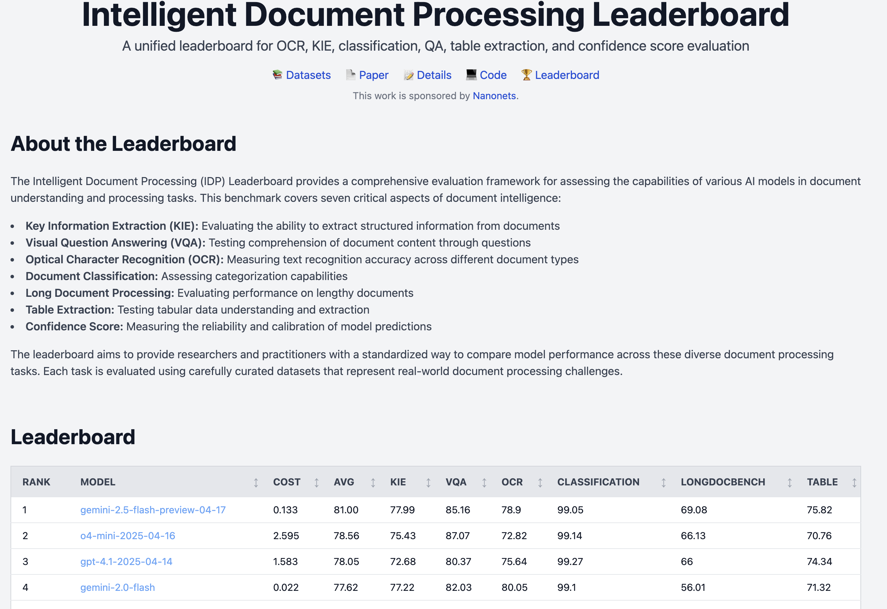

<h1 align="center">docext</h1>

<em>An on-premises document information extraction and benchmarking toolkit.</em>

  
  
  
  

  
  

## Overview

docext is an OCR-free tool for extracting structured information from documents such as invoices, passports, and other documents. It leverages vision-language models (VLMs) to accurately identify and extract both field data and tabular information from document images.

The [Intelligent Document Processing Leaderboard](https://idp-leaderboard.org/) tracks and evaluates performance vision-language models across OCR, Key Information Extraction (KIE), document classification, table extraction, and other intelligent document processing tasks.

## Features
### Intelligent Document Processing Leaderboard
This benchmark evaluates performance across seven key document intelligence challenges:

- **Key Information Extraction (KIE)**: Extract structured fields from unstructured document text.
- **Visual Question Answering (VQA)**: Assess understanding of document content via question-answering.
- **Optical Character Recognition (OCR)**: Measure accuracy in recognizing printed and handwritten text.
- **Document Classification**: Evaluate how accurately models categorize various document types.
- **Long Document Processing**: Test models' reasoning over lengthy, context-rich documents.
- **Table Extraction**: Benchmark structured data extraction from complex tabular formats.
- **Confidence Score Calibration**: Evaluate the reliability and confidence of model predictions.

🔍 For in-depth information, see the [release blog](https://github.com/NanoNets/docext/tree/main/docext/benchmark).

📊 **Live leaderboard:** [https://idp-leaderboard.org](https://idp-leaderboard.org)

For setup instructions and additional details, check out the full feature guide for the [Intelligent Document Processing Leaderboard](https://github.com/NanoNets/docext/tree/main/docext/benchmark).

### Docext
- **Flexible extraction**: Define custom fields or use pre-built templates
- **Table extraction**: Extract structured tabular data from documents
- **Confidence scoring**: Get confidence levels for extracted information
- **On-premises deployment**: Run entirely on your own infrastructure (Linux, MacOS)
- **Multi-page support**: Process documents with multiple pages
- **REST API**: Programmatic access for integration with your applications
- **Pre-built templates**: Ready-to-use templates for common document types:
  - Invoices
  - Passports
  - Add/delete new fields/columns for other templates.
For more details on the features, please check out the [feature guide](https://github.com/NanoNets/docext/tree/main/docext/benchmark).

## About

docext is developed by [Nanonets](https://nanonets.com), a leader in document AI and intelligent document processing solutions. Nanonets is committed to advancing the field of document understanding through open-source contributions and innovative AI technologies. If you are looking for information extraction solutions for your business, please visit [our website](https://nanonets.com) to learn more.

## Contributing

We welcome contributions! Please see [contribution.md](https://github.com/NanoNets/docext/blob/main/contribution.md) for guidelines.
If you have a feature request or need support for a new model, feel free to open an issue—we'd love to discuss it further!

## Troubleshooting

If you encounter any issues while using `docext`, please refer to our [Troubleshooting guide](https://github.com/NanoNets/docext/blob/main/Troubleshooting.md) for common problems and solutions.

## License

This project is licensed under the Apache License 2.0 - see the LICENSE file for details.
